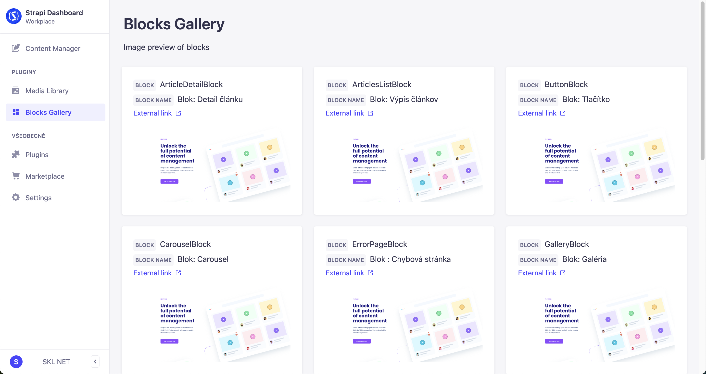

<h1 align="center">Strapi plugin Block Gallery</h1>

<p align="center">Creates gallery of Blocks, so you can see what they look like.</p>


## 👋 Intro

-   [Features](#features)
-   [Installation](#installation)
-   [Requirements](#requirements)

## <a id="features"></a>✨ Key features

-   **Automation:** Plugin automatically creates content-type "Blocks", and fills it with Strapi components that are created in folders which contain "block" in their name.
-   **Images:** You can add images to each block from your content-manager, and see them in plugins homepage. You will also be able to see the image in larger size inside modal window.
-   **External URLs:** You can also add external links to blocks if your images aren't stored in media library !

## <a id="installation"></a>🔧 Installation

Inside your Strapi app, add the package:

With `npm`:

```bash
npm install @sklinet/strapi-plugin-block-gallery
```

With `yarn`:

```bash
yarn add @sklinet/strapi-plugin-block-gallery
```

In `config/plugins.js` file add:

```js
"block-gallery":{
    enabled:true
};
```

If you do not yet have this file, then create and add:

```js
module.exports = () => ({
    "block-gallery":{
      enabled:true
    };
})
```

In order to see any components inside Block Gallery, you will have to store your components inside folders, which contains "block" in its name.

Plugin will fetch all components from these folders, and automatically create records into "Blocks" content-type with its name and displayName on first visit of its homepage.

Block name and displayName is value from yourProject/src/components/folderWithBlocks/block-name.json inside info object.

⚠️Please make sure, that all your components have correctly set info object in their schema, otherwise you'll see your block name as collectionName from the .json file.⚠️

Correctly set info object:

```js
// yourProject/src/components/folderWithBlocks/block-name.json
{
  "collectionName": "components_block_test_blocks",
  "info": {
    "name": "TestBlock", // <- Set your name to previously set displayName
    "displayName": "Block: Test", // <- Set your displayName to any name you want to be displayed
    "icon": "align-justify"
  },
  "options": {},
  "attributes": {
    "sectionId": {
      "type": "string"
    }
  }
}
```

Then run build:

```bash
npm run build
```

or

```bash
yarn build
```

After starting your project, navigate into plugins homepage (from left panel), and your blocks will be generated. You will see all your generated blocks after refresh or next visit of the plugin.

In order to add images or external links, update your records inside content-manager Blocks content-type.

## <a id="requirements"></a>⚠️ Requirements

Strapi **v4.x.x+**

Node **14 - 16**

Tested on **v4.4.1**
